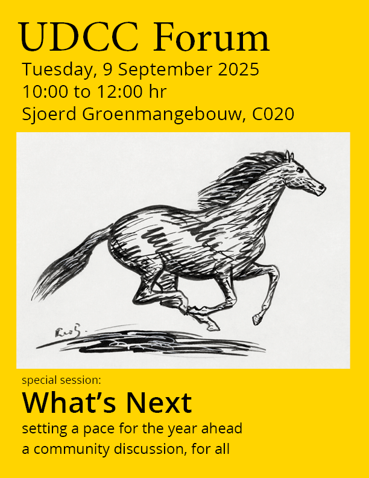
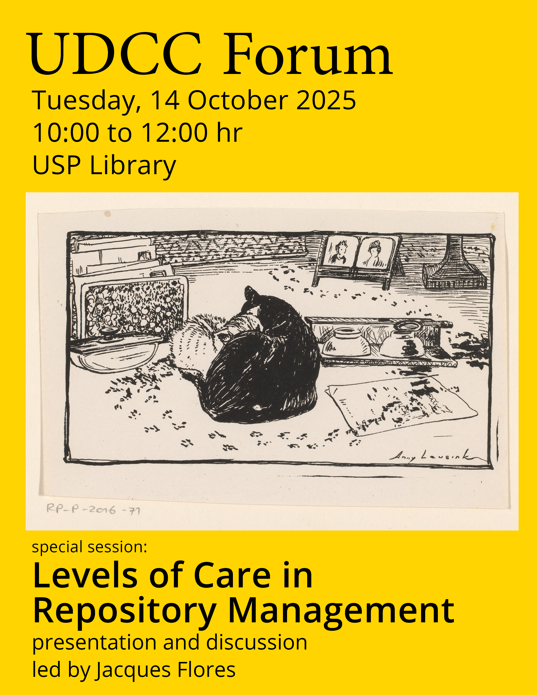
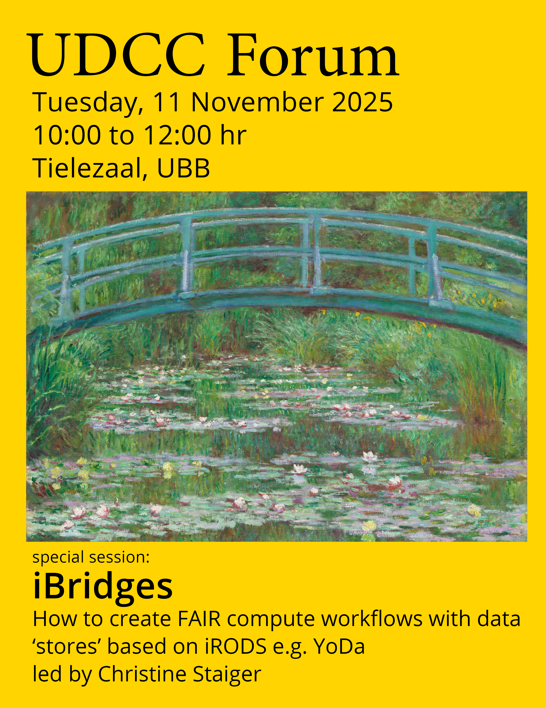
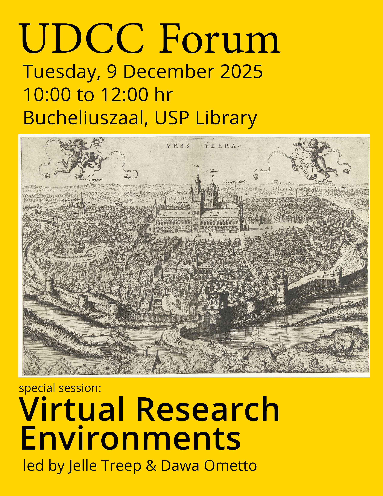
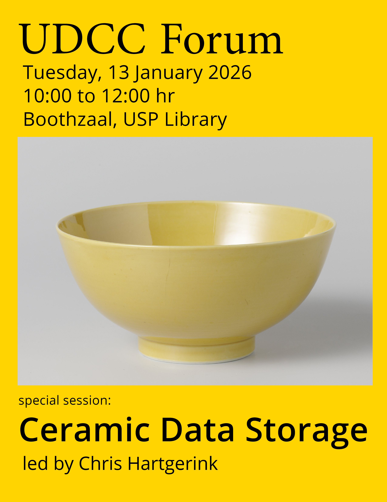
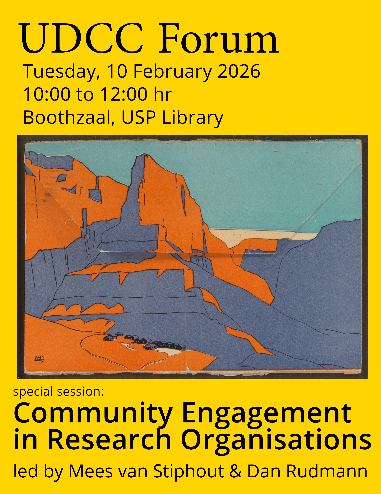
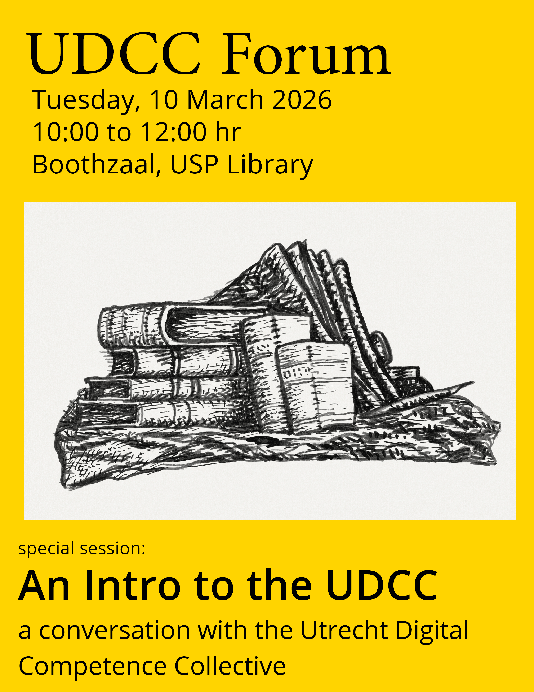
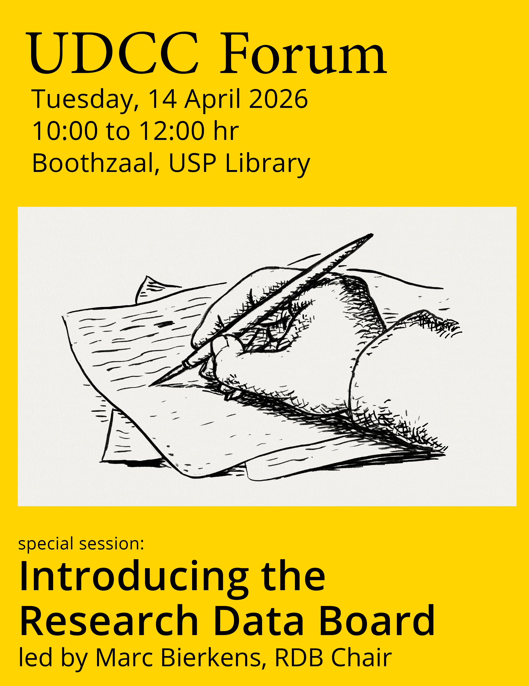
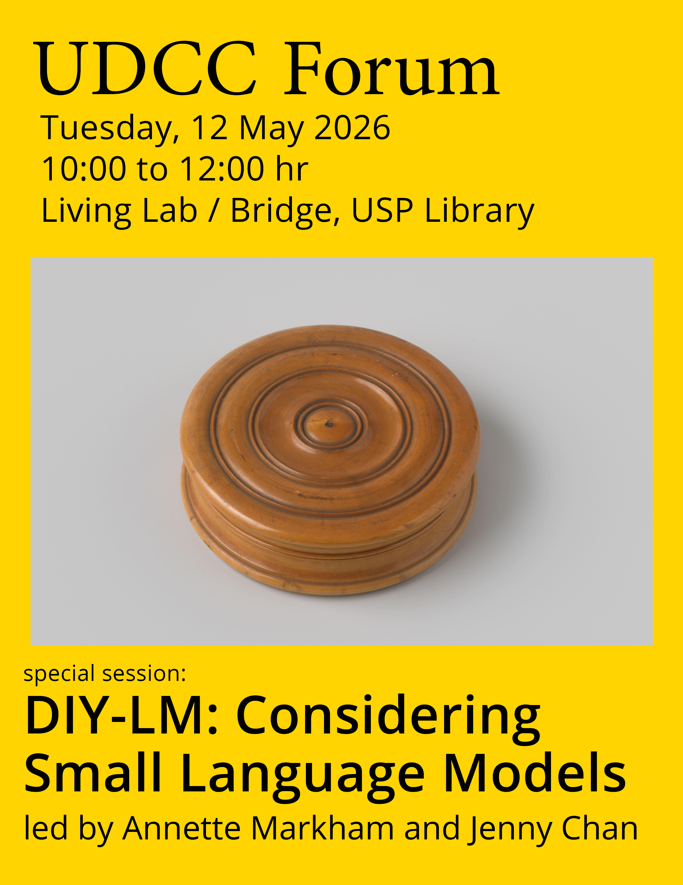
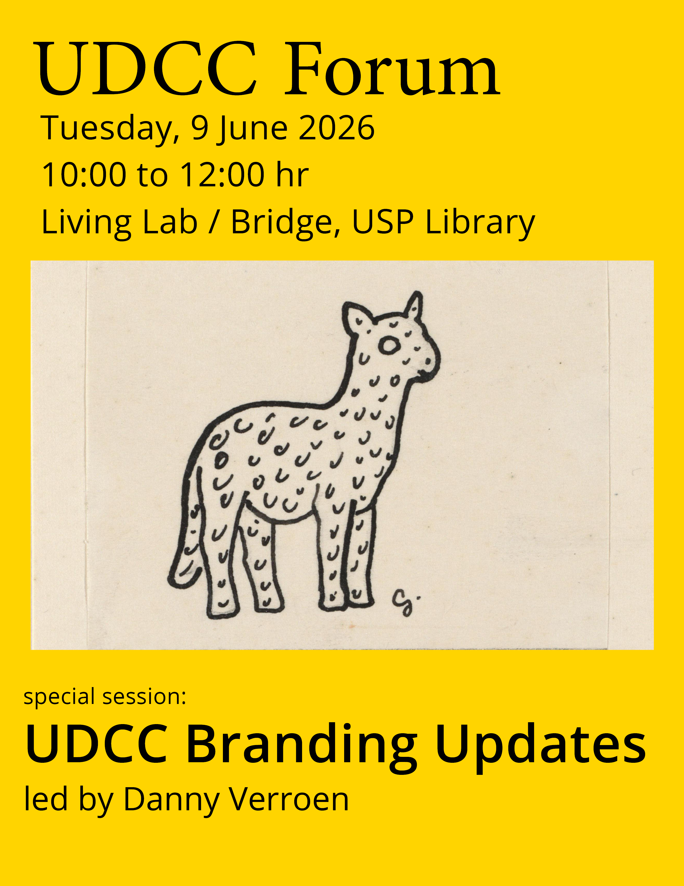

On the second Tuesday of each month, from September 2025 through to June 2026, colleagues from around Utrecht University met at the University Library to hold the UDCC Forum. Each of these events was an opportunity for people to share their work in digital competency for research and education, connect with their colleagues from across the institution, as well as develop new forms of recognition and professionalisation for work at the intersection of knowledge and technology. Our topics of discussion include issues in research data management, software, digital infrastructure, publishing, and Open Science. 

Herein we present those 10 sessions of the UDCC Forum through their fliers:

### September 2025: What's Next

{width=50%}

On September 9th, we convened our first Forum for the academic year. Therefore, we diverged from our typical format to collectively develop plans for the months ahead. What are we anticipating? Where can we collaborate and support one another?

### October 2025: Levels of Care in Repository Management

{width=50%}

On October 14th, our special session focused on Levels of Care in Repository Management, led by Jacques Flores. How might our approach to repositories reflect and inform perspectives on research data management and scientific collaboration? Jacques Flores will bring together local and international efforts to imagine and implement more robust infrastructures and forms of care. 

### November 2025: iBridges

{width=50%}

On November 11th, our special session explored iBridges: How to create FAIR compute workflows with data "stores" based on iRODS e.g. YoDa and was led by Christine Staiger. Many universities and research institutes in the Netherlands are using open source data management systems based on iRODS, e.g. YoDa. In many cases, those systems are used to simply store data and organise data collections for archiving, publication, and other kinds of sharing. It is not always clear how to incorporate iRODS/YoDa into a computational workflow without having to download and upload files to the server. In this UDCC Forum, we demonstrated how metadata in the active part of the life cycle can help organise research results.

### December 2025: Virtual Research Environments

{width=50%}

On December 16th, our special session explored Virtual Research Environments and was led by Jelle Treep and Dawa Ometto. VREs are increasingly used in research as a 'user friendly' form of cloud computing for increased computing power, collaboration, and secure data handling. In this session we presented the current state of VREs, and involved the community in setting future directions. 

### January 2026: Ceramic Data Storage

{width=50%}

In our first Forum of 2026, January 13th, our special session introduced Ceramic Data Storage and was led by Chris Hartgerink. Research data storage at scale is a growing problem. A new wave of technologies are in development using data storage in innovative physical or optical carriers. One promising example is ceramic data storage, which enables write-once, read-many access patterns that are cost-effective over decades if not centuries. In this talk, Chris Hartgerink introduced ceramic data storage as a potential candidate for research archival and invited the community to discuss participation in a pilot project which would involve the donation of research information for archival purposes. 

### February 2026: Community Engagement in Research Organisations

{width=50%}

On February 10th, our special session convened a discussion on Community Engagement in Research Organisations led by Mees van Stiphout and Dan Rudmann. How might we develop strategies and practices that build bridges within our communities, particularly among researchers, data managers, educators, research software engineers, graduate students, librarians, and other research professionals? As we continue to enhance our competencies in digital research methods and management, how might we translate those competencies toward partnerships in scholarly endeavors?

### March 2026: Intro to the UDCC

{width=50%}

On March 10th, our special session introduced and reflected upon the vision and strategy of the UDCC. How might we continue to develop practices that build bridges within our communities, particularly among researchers, data managers, educators, research software engineers, graduate students, librarians, and other research professionals? As we continue to enhance our competencies in digital research methods and management, how might we translate those competencies toward partnerships in scholarly endeavors?

### April 2026: Introducing the Research Data Board

{width=50%}

On April 14th, our special session introduced the Research Data Board to the UDCC in a discussion led by RDB Chair Marc Bierkens. From the RDB website: "The Research Data Board is Utrecht University's central coordinating body for everything related to research data and the software developed for this purpose. The board provides strategic advice to the Executive Board on how data can be made available in a FAIR (Findable, Accessible, Interoperable, Reusable), secure, ethical and sustainable manner."

### May 2026: DIY-LM: Considering Small Language Models

{width=50%}

On May 12, our special session considered applications for small language models at research organisations in a discussion led by Professor Annette Markham and MA researcher Jenny Chan. The Futures+Literacies+Methods Lab has developed a training workshop for DIY Small Language Models that works really well for mixed experience audiences. This performative workshop demystifies SLMs, demos the setup, and gets participants actively using the SLM, all in 2.5 hours. The performative and creative pedagogy of the workshop delivers two big wins: First, the expert facilitators embed critical AI literacies focused on ethics and sustainability. Second, they build competencies in fun yet practical ways, enabling participants to learn, adopt, and actually use SLMs in their workflows.

In this session, the FLL team was keen to talk about how this might be scaled out or up at UU and beyond. As we all know, local or small language models offer highly desirable and ethically sensible alternatives to large or pay-per-use LLMs. Especially for small research consortia, nonprofit enterprises, small companies, SLMs offer private, protected, economical, environmentally sensitive, and less “Big-Tech”-driven solutions. But while SLMs can be ideal for handling specific tasks on local devices, or automating parts of one’s analysis tasks or workflows, they are not easy to comprehend, install, and effectively use unless one has some prior background. Of course, there are off the shelf or corporatized solutions, but we think this DIY SLM is a more ethical solution.  

### June 2026: Branding Updates

{width=50%}

On June 9th, our special session featured an update on the branding activity undertaken by Petra Davids and Danny Verroen. Danny presented the latest developments in branding and facilitated a discussion for feedback and next steps.

### Fin
